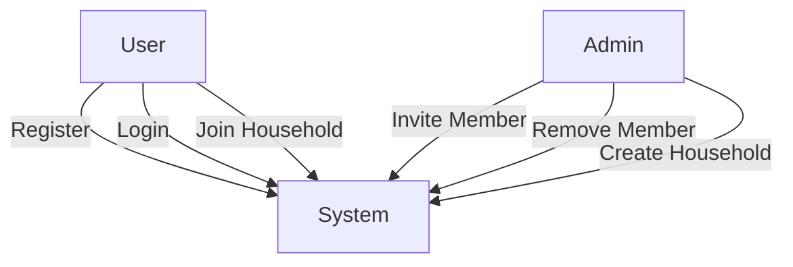
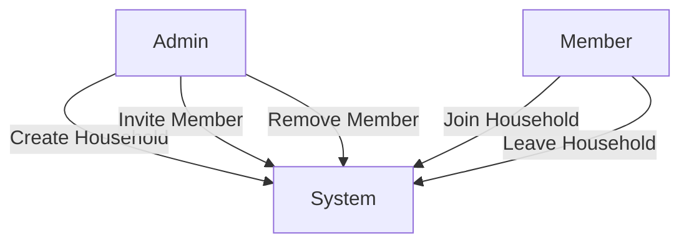
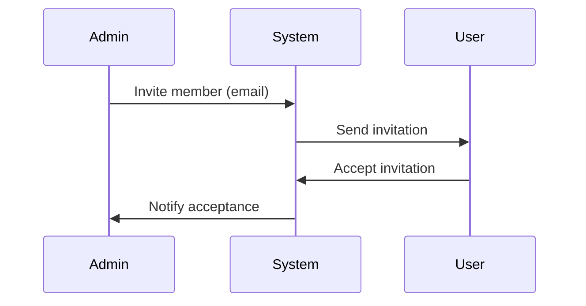
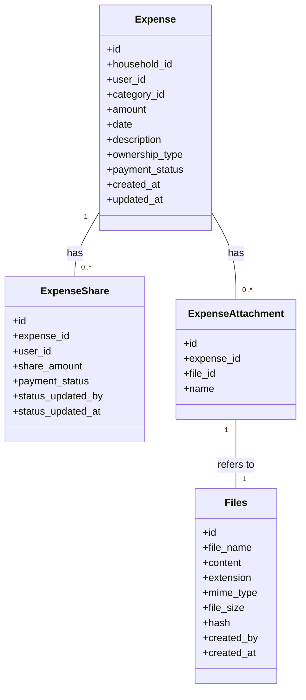
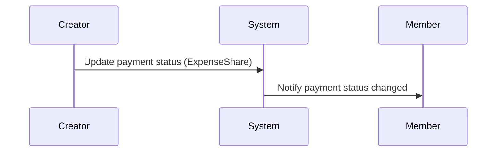
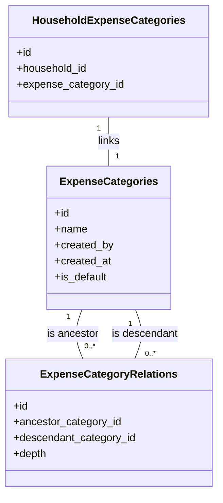
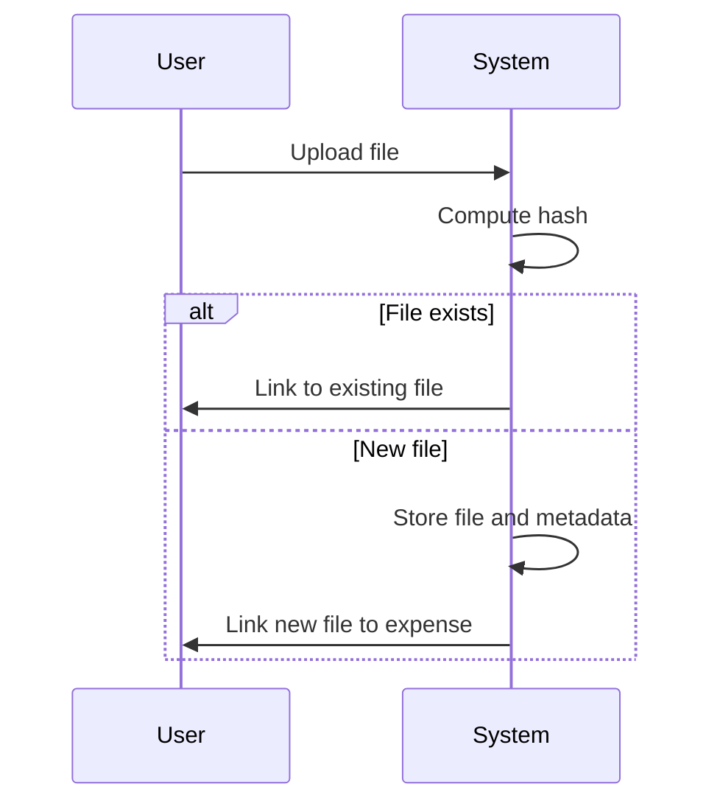
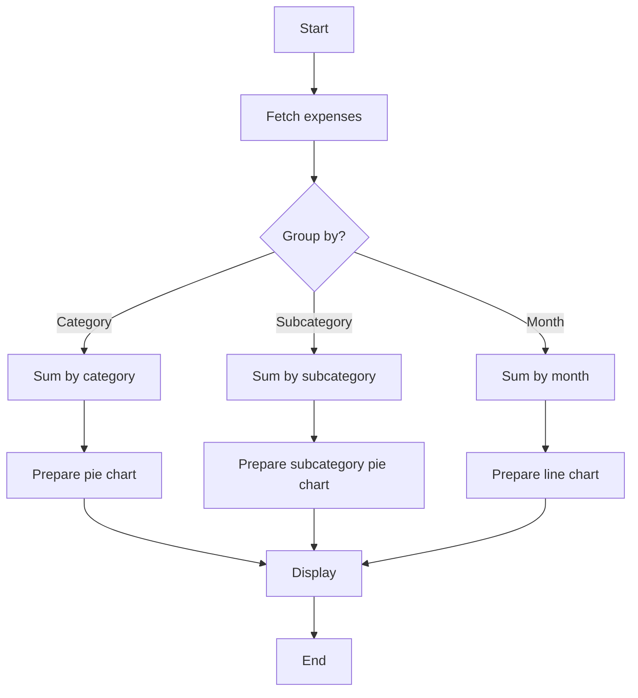
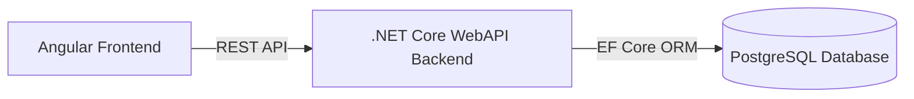

# Hobby Household Expense Tracking System - Product Requirements Document (PRD)

## 1. Purpose

To provide households with a simple, secure web-based system for tracking shared and individual expenses, categorizing them, managing attachments, and visualizing spending over time. The system supports multiple households, role-based management, and detailed reporting, using a modern tech stack.

---

## 2. Key Features (with Mermaid Diagrams)

### 2.1. User Management

**Description:**  
User registration, authentication, assigning to household, etc.

**Mermaid Flowchart (User Management Use Cases):**

---

### 2.2. Household Management

**Description:**  
Household creation, member management, admin actions.

**Mermaid Flowchart (Household Management Use Cases):**

**Mermaid Sequence Diagram (Inviting a Member):**

---

### 2.3. Expense Management

**Description:**  
Expense creation, editing, payment status, splitting, etc.

**Mermaid Class Diagram:**

**Mermaid Sequence Diagram (Mark Expense as Paid):**

---

### 2.4. Category Management

**Description:**  
Hierarchical categories and subcategories, managed by admin.

**Mermaid Class Diagram:**

---

### 2.5. Attachments

**Description:**  
File upload, deduplication, and attachment management.

- Each expense may have up to **3 attachments**.
- Supported file types: `png`, `jpg`, `jpeg`, `pdf`, `doc`, `docx`, `zip`, `7z`.
- Max file size per attachment: 10MB.
- Files are stored as BLOBs in the database, with content, file name, extension, mime type, size, hash of the content (for deduplication/tracking), and upload timestamp.
- Each attachment is tied to the expense and uploader.
- The system will compute and store a hash of each file's content to track if the file already exists.

**Mermaid Sequence Diagram (File Upload & Deduplication):**

---

### 2.6. Dashboard & Reporting

**Description:**  
Visualization and reporting for household expenses.

- **Pie Chart (Category):** Not highly detailed, shows monthly spend by top-level category.
- **Pie Chart (Subcategory):** Detailed, shows monthly spend by subcategory.
- **Line Chart:** Monthly total expenses over the past 12 months (chosen for clarity and informativeness).
- **Table:** All pending payments for the household (shows expense, category, amount, date, and responsible member(s); payment status and last update columns are omitted).

**Mermaid Flowchart (Generate Dashboard Data):**

---

## 3. Data Model (High-Level)

- **User:** id, name, email, password (hashed)
- **Household:** id, name, created_by, created_at
- **HouseholdMember:** id, household_id, user_id, joined_at

- **ExpenseCategories:** id, name, created_by, created_at, is_default  
  (A plain nomenclature table for all categories and subcategories.)

- **ExpenseCategoryRelations:** id, ancestor_category_id, descendant_category_id, depth  
  (Closure table modeling hierarchical relations between categories and subcategories.)

- **HouseholdExpenseCategories:** id, household_id, expense_category_id  
  (Links households to their allowed/visible categories.)

- **Expense:** id, household_id, user_id (creator), category_id, amount, date, description, ownership_type (`household` or `shared`), payment_status (for household-wide), created_at, updated_at

- **ExpenseShare:** id, expense_id, user_id, share_amount, payment_status (per user), status_updated_by, status_updated_at

- **Files:** id, file_name, content (blob), extension, mime_type, file_size, hash, created_by, created_at

- **ExpenseAttachment:** id, expense_id, file_id, name

---

## 4. Technical Stack & Architecture

**Mermaid Component Diagram:**

- **Frontend**
  - **Framework:** Latest stable Angular
  - **UI:** Angular Material, Flexbox
  - **Communication:** RESTful API to backend

- **Backend**
  - **Framework:** Latest stable .NET (ASP.NET Core WebAPI)
  - **Architecture:** Clean Architecture, vertical slice pattern:
    - **Domain:** All DB models/entities
    - **Application:** Business logic/services per feature
    - **Persistence:** EF Core for PostgreSQL, repositories
    - **Presentation:** API controllers
  - **Mapping:** AutoMapper
  - **Validation:** FluentValidation
  - **Database:** PostgreSQL
  - **File Storage:** Attachments as BLOBs in DB
  - **Authentication:** JWT
  - **Settings:** Separate configuration files for development and production environments

---

## 5. Constraints & Success Criteria

- Must be split into frontend and backend, cleanly separated.
- All API endpoints (except auth) require JWT.
- File type and size validation for attachments.
- Only one admin per household; strict separation of admin/member roles.
- All status changes and sensitive actions are auditable (timestamp and user).
- Must be easy to deploy in both dev and prod environments (separate config).
- Success is a stable, secure MVP that allows full expense tracking, category management, and visualization for multi-user households.

---

## 6. Open Questions / To Review

- [ ] Any additional requirements for auditing or history tracking?
- [ ] Any notification/email features needed (e.g., for pending payments)?
- [ ] Any API rate limits, session expiration, or security hardening requirements?
- [ ] Any requirements for localization/language support?
- [ ] Any accessibility standards to meet?

---

## [Appendix] Mermaid Diagram Legends

Refer to [Mermaid Syntax Docs](https://mermaid-js.github.io/mermaid/#/) for symbols and notation.